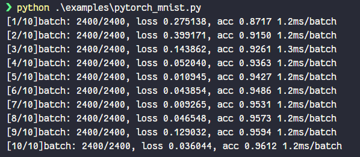
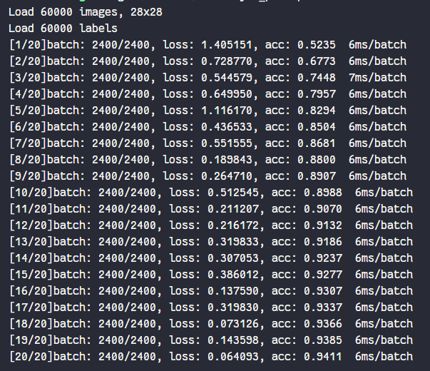
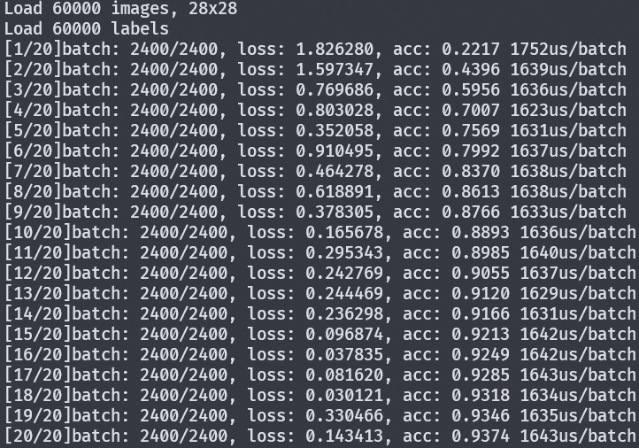

# Multilayer_Perceptron by Rust

用Rust实现基础的全连接神经网络，并用`mnist`数据集进行训练。

- 使用数组构建二维矩阵，并重载了相关运算符，其中使用`&`表示矩阵乘法
- 实现了全连接层和softmax输出层的前馈网络以及方向传播
- 加入了Adam优化器
- 运算效率较低，且收敛较慢，使用pytorch进行对比，编译后的文件每轮耗时大约是pytorch的5倍。其中Adam运算部分最为耗时，其次是矩阵运算部分。

<center>

<p><b>pytorch result</b></p>
</center>
<center>

<p><b>rust result</b></p>
</center>

## 运行方法

```bash
git clone https://github.com/Dragon-GCS/rust-dnn.git
cd rust-dnn
cargo build -r
```

## 相关公式

- Relu:
  $$f(x) =\begin{cases} x & x>0 \\\ 0 & x\le0\end{cases}$$

  $$f\prime(x) =\begin{cases} 1&x>0 \\\ 0&x\le0\end{cases}$$
- Sigmoid:
  $$\sigma(x) = \frac{1}{1+e^x}$$
  $$\sigma\prime(x)=\sigma(x)(1-\sigma(x))$$
- Softmax:
  $$f(x) = \frac{e^{x_i}}{\sum_{j}e^{x_j}}$$
  $$f\prime(x)= f(x_i)(1 - f(x_i)) + \sum_{j\neq i} f(x_j) f(x_i) $$
- Cross Entropy(Prime include softmax activation):
  $$f(\hat{y}, y) = -\frac{1}{n}\sum^n_{i=1}y_i\ln\hat{y}_i$$
  $$f_i\prime(\hat{y}, y) = \hat{y_i} - y_i$$
- Adam Optimizer:
  $$v_t = \frac{\beta_1*v_{t - 1} + (1 - \beta_2)*dW}{1 - \beta_1^t}$$

  $$s_t = \frac{\beta_2*s_{t - 1} + (1 - \beta_2)*dW}{1 - \beta_2^t}$$
  $$W = W - \alpha * \frac{v_t}{\sqrt{s_t} + \epsilon}$$

## 计算优化

<center>

</center>

- 函数签名使用引用传递，尽可能避免数据复制, 优化后batch时间 6ms -> 4ms
- 数组填充元素时两种方法
  1. 使用`Vec::with_capacity`预先分配内存，在逐个推入元素。
  2. 使用`0`初始化数组，然后逐个赋值。
  > 两种方法在性能上没有明显差异，但在做矩阵运算时需要根据行列计算索引，有额外的计算开销
- 使用`rayon`并行计算梯度，优化时间从4ms -> 1.6ms
  > 并行计算时需要考虑线程开销，梯度并行计算只有f64的复制损耗，计算开销大于线程开销，多线程提升明显
